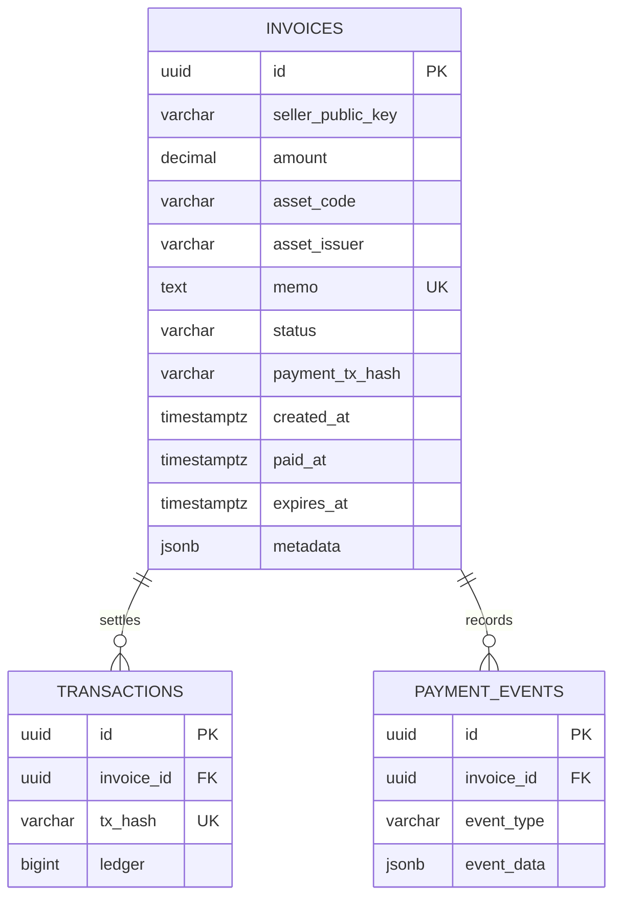

# In-memory to Postgres cutover

Status: proposed. This document designs the cutover; it does not activate or
deploy a migration.

## Decision

Quittance will switch invoice writes from one storage adapter to the other at a
single release boundary. It will not dual-write. The Postgres database is
loaded and verified before traffic moves, then becomes the only source of truth.

Local development keeps the existing npm run dev:mvp command and in-memory
adapter. Persistent environments use the full server with DATABASE_URL. A
future unified entrypoint may expose INVOICE_STORAGE=memory or postgres, but
the current separate commands are already an explicit, low-risk flag:

| Environment | Command | Storage | Expected loss after restart |
| --- | --- | --- | --- |
| Local UI work | npm run dev:mvp | memory | accepted |
| Ephemeral demo | npm run dev:mvp | memory | accepted only when disclosed |
| Shared demo or production | npm run dev | Postgres | none after committed write |

A public demo can accept loss of invoices created since its last restart. Any
URL created before a planned production cutover has a zero-loss requirement:
freeze writes, export the live process, import once, verify, then route traffic.
If the memory process cannot export its current map, those links cannot be
recovered after the process stops. The cutover must therefore happen before
that stop.

## Public identity contract

The following values are copied verbatim and remain immutable:

- id, which is the path segment for /pay/[id] and /invoice/[id];
- memo, which maps a Stellar transaction to one invoice;
- sellerPublicKey, which scopes dashboard history;
- status, paymentTxHash, payer fields, paidAt, createdAt, and expiresAt, which
  make an already-paid proof reproducible;
- amount, assetCode, and assetIssuer, which define what was paid.

Both current services create UUID v4 IDs, so no format translation is needed.
The importer must supply each existing ID explicitly and must never call either
service's ID or memo generator. Duplicate IDs or memos abort the import. They
must not be rewritten because that would silently break old URLs or payment
matching.

The frontend generates proof content from GET /api/invoices/:id. Proof files
are not stored separately. A stable row containing the same ID, status,
paymentTxHash, paidAt, amount, asset identity, seller, payer, and description is
therefore sufficient to preserve proof download and email behavior.

## Target table and ERD

The executable schema remains db/schema.sql. The review-only minimal draft is
docs/postgres-cutover-draft.sql and follows StoredInvoice exactly.

Required indexes are:

- primary key on id for public pay and invoice reads;
- unique index on memo for one-invoice payment mapping;
- seller_public_key plus created_at descending for wallet history;
- partial expires_at index where status is PENDING for expiry maintenance;
- unique payment_tx_hash when populated, to prevent one chain transaction from
  proving two invoices.

The existing schema has all but the last uniqueness rule. Add that rule only
after checking historical duplicates in the implementation PR.

## Query boundaries

Public payment and proof routes intentionally read one invoice by opaque UUID.
They must never expose list or search behavior.

Wallet routes require sellerPublicKey and include it in the database predicate:

| Operation | Required predicate |
| --- | --- |
| List dashboard invoices | seller_public_key = caller wallet |
| Statistics | seller_public_key = caller wallet |
| Cancel | id = requested id AND seller_public_key = caller wallet |
| Public pay or proof read | id = opaque public id |
| Verify payment | id = public id; chain destination must equal row seller |

The parity suite must run the same handler cases against both adapters. Add a
negative fixture in which seller A requests seller B's list, stats, and cancel
operation before cutover.

## Preflight and empty database boot

1. Merge shared StoredInvoice types and verify-hardening changes first.
2. Provision Postgres with backups and point DATABASE_URL at it.
3. Run npm run db:migrate twice; the second run must be a no-op.
4. Confirm invoices, transactions, and payment_events exist and the invoice
   columns match StoredInvoice.
5. Start the full server against the empty database.
6. Confirm /api/health reports postgres and /api/ready succeeds.
7. Create, read, verify, download proof, list, and cancel disposable invoices.
8. Delete the disposable database or rows before importing production data.

An empty database is valid. No seed is required for readiness or boot.

## Snapshot import

The implementation PR should add a one-shot export/import tool with these
properties:

1. Put the memory API in read-only drain mode.
2. Export one versioned JSON document from the live process.
3. Record the count and SHA-256 digest.
4. In one Postgres transaction, insert every row with its original values.
5. Reject unknown fields, invalid UUIDs, duplicate IDs/memos, malformed asset
   identities, and PAID rows without a transaction hash and paid timestamp.
6. Compare source and target counts and per-row canonical digests.
7. Exercise a sample of pending, expired, cancelled, and paid public links.
8. Keep the old process running read-only until the new deployment passes.

No live request writes to both systems. The read-only window is the only planned
write outage.

## Cutover checklist

### Before routing traffic

- Shared storage contract and parity tests are green.
- Verify checks memo, destination, seven-decimal amount, asset code and issuer,
  and network.
- Database migration and snapshot import are complete.
- Imported IDs and memos match the export exactly.
- Seller A cannot list, count, or cancel seller B's invoices.
- Existing paid and pending URLs return the same JSON from Postgres.
- A paid invoice downloads a proof with the same tx hash and paidAt.
- Backups, DATABASE_URL, health checks, and alerting are configured.

### Traffic switch

1. Enable read-only mode on memory.
2. Take the final snapshot and import transaction.
3. Run count, digest, link, and cross-seller checks.
4. Deploy the full server or route the API hostname to it.
5. Keep memory read-only for one observation window.
6. Remove the old instance after the rollback window closes.

### Rollback

Stop new writes, keep the database, and route to the previous compatible full
server release. Do not route back to writable memory after Postgres accepted a
write; that would fork IDs and payment state. Schema changes for the first
cutover are additive, so an application rollback does not require a database
rollback.

If validation fails before traffic switches, discard the target rows, correct
the importer, and repeat from the same read-only snapshot.

## Compatibility acceptance

Before declaring the cutover complete, capture these examples from the old
server and compare them field-for-field with the new server:

- one PENDING /pay/[id] response and its payment URI;
- one PAID /pay/[id] response and downloadable proof;
- one /invoice/[id] seller detail response;
- wallet-scoped list and stats for two different sellers;
- one expired and one cancelled invoice;
- one issued-asset invoice including assetIssuer.

HTTP status, success envelope, field names, date serialization, amount
precision, and null-versus-omitted behavior are part of compatibility.

## Sequencing

1. Shared StoredInvoice and handler parity.
2. Canonical verify hardening.
3. Database constraints and snapshot tooling.
4. Dry run against a copy of a real snapshot.
5. Read-only import and traffic cutover.
6. Durable automatic payment monitoring.
7. Remove temporary export and drain endpoints after the rollback window.

This order prevents the importer from freezing an obsolete shape and ensures a
payment cannot be marked PAID under weaker rules during the cutover.
